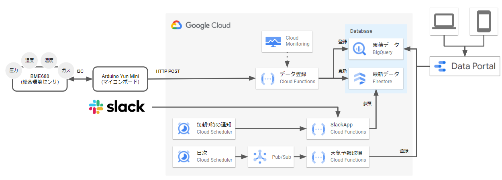

# room-monitor
BME680とArduino Yun Miniを使った部屋の環境モニタリングをするためのコード
https://qiita.com/k-akie/items/9a3528c5345db045e061

## フォルダ構成
- arduino
  - Arduino Yun Mini用のコード
- functions
  - Google Cloud Functions用のコード
    - register_monitoring_data: モニタリングデータ登録
    - fetch_weather_forecast: 天気予報情報の取得
    - slack_app: Slackアプリ(最新のモニタリングデータ参照コマンド)
    - reset_warning: 暑すぎ・寒すぎの警告情報をリセットする

## システム構成

